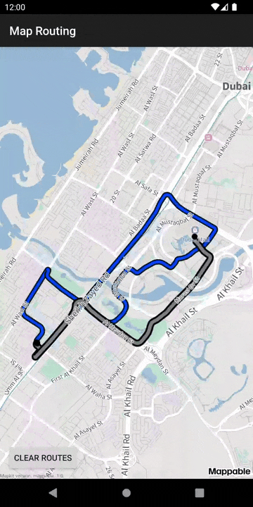

# Mappable MapKit Demo Apps

Mappable Mapkit lets you embed interactive maps in iOS and Android mobile apps and give users access to Mappable’s technology and cartographic data. Learn more about the MapKit SDK on the [documentation](https://mappable.world/docs/mapkit/index.html?from=github-demo) page.

Visit the [getting started](https://mappable.world/docs/mapkit/android/quickstart.html) page for quick start development with the MapKit SDK.

The current repository contains sample code for how to use the MapKit SDK for Android applications.

## Project structures

There are two Android projects in the repository:

1. [__```mapkit-samples```__](mapkit-samples): Contains several Android applications with sample code in Kotlin, all of which are demonstrated in the MapKit SDK Tutorials documentation.

    - [```map-with-placemark```](mapkit-samples/map-with-placemark): A simple MapKit SDK application with [Map and Placemark](https://mappable.world/docs/mapkit/android/tutorials/map_with_placemark.html).

    - [```map-objects```](mapkit-samples/map-objects): Using the [Map Objects API](https://mappable.world/docs/mapkit/android/tutorials/map_objects.html) to add objects to the map.

    - [```map-interaction```](mapkit-samples/map-interaction): Examples from the [Map Interaction](https://mappable.world/docs/mapkit/android/tutorials/map_interaction.html) tutorial.

    - [```map-search```](mapkit-samples/map-search): Examples of how to use the [Search](https://mappable.world/docs/mapkit/android/tutorials/map_search.html) and [Geosuggest](https://mappable.world/docs/mapkit/android/tutorials/map_suggest.html) functionality.

    - [```map-routing```](mapkit-samples/map-routing): About the [Routes](https://mappable.world/docs/mapkit/android/tutorials/map_routes.html) and [Routing](https://mappable.world/docs/mapkit/android/tutorials/map_routing.html) API.

2. [__```mapkit-demo```__](mapkit-demo): A demo application in Java that contains the basic functionality of the lite and full MapKit SDK versions. It is not supported with Tutorials documentation, unlike the ```mapkit-samples``` project.

## Build locally

1. Clone the repository:
    ```sh
    git clone https://github.com/mappable-world/mapkit-android-demo.git
    ```

2. Demo applications use the MapKit SDK, which requires __API key__. You can get a free MapKit __API key__ in the [Get the MapKit API Key](https://mappable.world/docs/mapkit/android/quickstart.html#key) documentation.

3. Depending on the project you want to build, follow the steps in the following sections.

### mapkit-samples

1. Open or create the __project's__ ```local.properties``` file. Add the following property with your __API key__ value in place of the ```YOUR_API_KEY``` placeholder:

    ```properties
    MAPKIT_API_KEY=YOUR_API_KEY
    ```

2. Choose a target in Android Studio for the build or use a CLI build with gradle wrapper:

    ```sh
    ./gradlew :map-with-placemark:assembleRelease
    ```

### mapkit-demo

1. Open the [```MainApplication.java```](mapkit-demo/src/main/java/world/mappable/mapkitdemo/MainApplication.java) and edit the ```MAPKIT_API_KEY``` field, setting its value with your __API key__ in place of the ```your_api_key``` placeholder:

    ```java
    private final String MAPKIT_API_KEY = "your_api_key";
    ```

2. Run the __mapkit-demo__ target in Android Studio or use the CLI build with gradle wrapper:

    ```sh
    ./gradlew assembleLiteRelease  # Lite MapKit samples only
    ./gradlew assembleFullRelease  # Lite and full
    ```

## Support

If you have problems or suggestions while using MapKit, visit our [technical support](https://mappable.world/docs/mapkit/troubleshooting.html) page.

## Sample overview

| [map-with-placemark](mapkit-samples/map-with-placemark) <br>Demonstrates how to create a MapKit map, move<br>it, and display custom tappable placemarks. | [map-objects](mapkit-samples/map-objects) <br>How to display different objects on the map, including:<br>images, geometries, and clusterized collections. |
|:-|:-|
|  |  |

| [map-interaction](mapkit-samples/map-interaction)<br> About interacting with the MapKit map using <br>camera movements, tap actions, focus rect <br> and focus point, and interactions with POIs. | [map-search](mapkit-samples/map-search) <br>Shows how to use Search and Geosuggest <br>functionality in the full MapKit SDK. |
|:-|:-|
|  |  |

| [map-routing](mapkit-samples/map-routing)<br> Building routes using requested map points. |
|:-|
|  |
